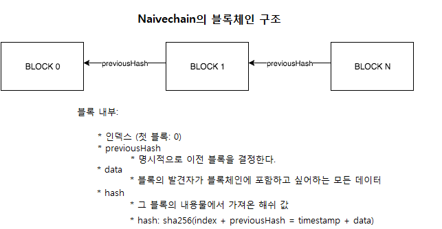

# Naivechain - 블록체인 실행 200줄 코드

### 개발 동기
모든 현재 구현된 블록체인들은 밀접하게 결합되어있고 개발자들이 해결하려고 하는 문제들(ex: 비트코인, 이더리움)들과 밀접하게 결합되게 됩니다.
그들의 생각을 소스코드로 이해하기는 어려운 일입니다. 이 프로젝트는 가능한 블록체인이 간결하고 단순하게 실행하기 위한 것입니다.
 
### 블록체인은 무엇인가?
[From Wikipedia](https://ko.wikipedia.org/wiki/%EB%B8%94%EB%A1%9D%EC%B2%B4%EC%9D%B8) : 블록체인은 조작 및 수정 작업으로부터 보호되는 블럭이라는 지속적으로 증가하는 기록저장소를 유지하는 분산 데이터베이스입니다.

### Key concepts of Naivechain
Check also [this blog post](https://medium.com/@lhartikk/a-blockchain-in-200-lines-of-code-963cc1cc0e54#.dttbm9afr5) for a more detailed overview of the key concepts
* HTTP interface to control the node
* Use Websockets to communicate with other nodes (P2P)
* Super simple "protocols" in P2P communication
* Data is not persisted in nodes
* No proof-of-work or proof-of-stake: a block can be added to the blockchain without competition





### Naivecoin
For a more extensive tutorial about blockchains, you can check the project [Naivecoin](https://lhartikk.github.io/). It is based on Naivechain and implements for instance Proof-of-work, transactions and wallets.

### Quick start
(set up two connected nodes and mine 1 block)
```
npm install
HTTP_PORT=3001 P2P_PORT=6001 npm start
HTTP_PORT=3002 P2P_PORT=6002 PEERS=ws://localhost:6001 npm start
curl -H "Content-type:application/json" --data '{"data" : "Some data to the first block"}' http://localhost:3001/mineBlock
```

### Quick start with Docker
(set up three connected nodes and mine a block)
###
```sh
docker-compose up
curl -H "Content-type:application/json" --data '{"data" : "Some data to the first block"}' http://localhost:3001/mineBlock
```

### HTTP API
##### Get blockchain
```
curl http://localhost:3001/blocks
```
##### Create block
```
curl -H "Content-type:application/json" --data '{"data" : "Some data to the first block"}' http://localhost:3001/mineBlock
``` 
##### Add peer
```
curl -H "Content-type:application/json" --data '{"peer" : "ws://localhost:6001"}' http://localhost:3001/addPeer
```
#### Query connected peers
```
curl http://localhost:3001/peers
```
